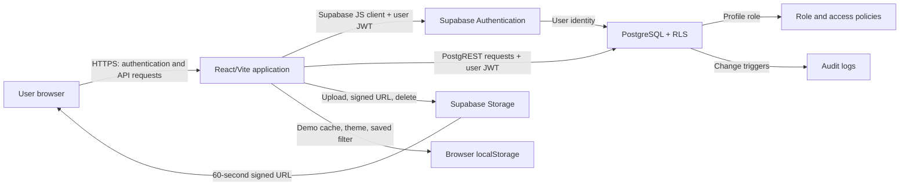

# ContractConnect Threat Model

**Version:** 1.1  
**Assessment date:** 10 August 2026  
**System reviewed:** React/Vite frontend, Supabase Authentication, PostgreSQL, Row Level Security, Storage, and SQL migrations in this repository  
**Assessment type:** Design and code review using STRIDE  

## 1. Executive summary

ContractConnect has useful security foundations: Supabase authentication, database Row Level Security (RLS), role-aware write policies, private contract-document storage, short-lived signed download URLs, file type and size restrictions, and database audit triggers.

The current application is suitable only for a controlled demonstration or a dedicated single-customer environment. It must not be operated as a shared multi-customer service. The database has no organisation or tenant boundary, and its read policies intentionally allow every authenticated user to read all CRM records in the Supabase project.

Repository hardening was implemented after the initial assessment. The new security migration adds inactive-by-default membership, least-privilege new profiles, active-member RLS, administrator approval, profile-listing policies, and runtime security telemetry. These controls remain **deployment pending** until the migration is run and the external Authentication, CI, monitoring, hosting, and WAF settings described in `SECURITY_OPERATIONS.md` are applied.

Four issues require treatment before an external production launch:

1. Make user onboarding invite-only and correct the post-governance default-role conflict.
2. Guarantee one Supabase project per customer until tenant-aware tables and RLS policies are implemented and tested.
3. remove automatic demo-data seeding and destructive demo reset from production builds.
4. Establish tested backup, monitoring, security verification, incident-response, and deployment controls.

## 2. Scope and assumptions

### In scope

- Browser-based React application
- Supabase email/password authentication and password recovery
- Profiles and application roles
- Companies, contacts, contracts, interactions, and follow-ups
- Contract-document uploads, downloads, metadata, and deletion
- Avatar uploads
- Audit logging
- CSV exports and browser local storage
- SQL migrations and application-to-Supabase data flows

### Out of scope or not verifiable from this repository

- Supabase's internal cloud infrastructure and operational controls
- DNS, domain registrar, and certificate management
- Production hosting configuration
- Web Application Firewall rules
- Email-provider security
- Endpoint security on customer devices
- Organisational support, personnel, and incident-response processes
- Backups configured through a Supabase commercial plan

### Operating assumptions

- The initial commercial release uses a dedicated Supabase project for each customer.
- The Supabase anonymous/publishable key is expected to be present in the browser; security depends on authentication and RLS, not secrecy of that key.
- No production customer data is approved for use yet.
- SQL migrations are applied in their documented order.

## 3. Architecture and trust boundaries

### Trust boundaries

1. **Public internet to browser application:** Untrusted users can load and modify client-side code and requests.
2. **Browser to Supabase:** Every request must be authenticated and authorised at the database or Storage layer.
3. **Authentication to application roles:** A valid Supabase identity is not automatically a trusted ContractConnect team member.
4. **General team to management:** Restricted documents, audit logs, and role management require stronger privileges.
5. **Customer to customer:** This boundary does not currently exist in the schema; it must be provided by separate deployments.
6. **Uploaded files to user device:** Documents are untrusted content even when uploaded by an authenticated user.
7. **Application data to localStorage and CSV:** Data leaves server-side access controls after it reaches the browser or is exported.

## 4. Security objectives

1. Only approved users may access a customer's workspace.
2. Users may perform only the actions permitted by their application role.
3. One customer must never access another customer's data.
4. Restricted documents must be available only to authorised managers and administrators.
5. Contract and relationship data must not be altered or deleted without authorisation and accountability.
6. Security-relevant activity must be attributable and reviewable.
7. The service must resist accidental and malicious data loss.
8. Uploaded files must not become a malware-delivery mechanism.
9. Credentials, recovery flows, and sessions must resist account takeover.
10. Production security controls must be continuously verified.

## 5. Assets

| Asset | Sensitivity | Security need |
|---|---|---|
| Company and contact information | Confidential/PII | Confidentiality, integrity |
| Contract values, dates, terms, and notes | Confidential/commercial | Confidentiality, integrity, availability |
| Interactions and follow-ups | Confidential/operational | Confidentiality, integrity |
| Contract documents | Highly confidential | Confidentiality, integrity, malware safety |
| User identities and role assignments | Security critical | Integrity, authenticity |
| Supabase sessions and recovery links | Security critical | Confidentiality, authenticity |
| Audit logs | Security critical | Integrity, availability, controlled access |
| CSV exports and local browser copies | Confidential | Confidentiality, lifecycle control |
| Supabase configuration and deployment settings | Security critical | Integrity, controlled administration |

## 6. Threat actors

- Anonymous internet user
- Unapproved user who creates an account
- Authenticated read-only user attempting to write
- Contributor attempting to access management information
- Malicious or careless manager/administrator
- Attacker using a stolen session or compromised mailbox
- User uploading a malicious document
- Attacker exploiting a vulnerable dependency or browser injection
- Operator making an incorrect migration, reset, or deployment change
- Future customer attempting to access another tenant

## 7. Risk-rating method

Likelihood and impact are scored from 1 (low) to 5 (very high). Risk is `likelihood x impact`.

| Score | Rating | Required response |
|---:|---|---|
| 20-25 | Critical | Must be resolved before production |
| 12-19 | High | Resolve before launch or formally accept with compensating controls |
| 6-11 | Medium | Plan and track remediation |
| 1-5 | Low | Monitor or accept |

## 8. STRIDE threat register

| ID | STRIDE | Threat and attack path | Existing controls | L | I | Risk | Required treatment |
|---|---|---|---|---:|---:|---:|---|
| TM-01 | Spoofing / Information disclosure | An unapproved person creates an account through public sign-up and becomes an authenticated database user. Authenticated users can read all CRM rows. | Email confirmation may be enabled; authentication required. | 4 | 5 | **20 Critical** | Disable public sign-up for production. Use administrator invitations or an approved-domain allowlist. Add an explicit membership/activation state checked by RLS. |
| TM-02 | Elevation / Denial of service | After the governance migration, the role constraint permits Administrator, Manager, Contributor, and Read-only, but the profile default remains Account Manager. A new-user trigger that omits the role can fail and block sign-up/profile creation. | Database constraint prevents an unknown role. | 4 | 4 | **16 High** | Change the default to Read-only or Contributor, update the trigger explicitly, and add a migration test for new-user creation. Prefer pending/inactive until invited. |
| TM-03 | Information disclosure | Every authenticated user can read all companies, contacts, contracts, interactions, and follow-ups because RLS uses `using (true)`. There is no tenant identifier. | Authentication; dedicated-project deployment is proposed. | 5 | 5 | **25 Critical** | Enforce dedicated projects contractually and operationally. Before shared SaaS, add organisations, memberships, `organisation_id` on every record, tenant-aware RLS, and automated isolation tests. |
| TM-04 | Elevation / Tampering | The browser controls which buttons appear. A user can modify the client or send direct API requests. | Server-side RLS limits writes to Administrator, Manager, and Contributor roles; role-change trigger protects role assignments. | 2 | 5 | **10 Medium** | Retain RLS as the authority. Add automated negative tests for each role and table. Never rely on `canWrite` or `canManage` alone. |
| TM-05 | Information disclosure / Availability | Governance requests all profiles, but the retained profile SELECT policy allows users to read only their own profile. Administrators may not be able to manage or review the full team. | Own-profile policy; administrator update policy. | 4 | 3 | **12 High** | Add a SELECT policy allowing administrators and, if intended, managers to list appropriate team profiles. Test profile enumeration and role administration. |
| TM-06 | Tampering / Information disclosure | `owner_id` exists for companies and contracts, but application mappings use a free-text owner and ignore `owner_id`. Ownership therefore provides no access boundary or reliable accountability. | Foreign-key columns exist. | 4 | 4 | **16 High** | Read and write authenticated owner IDs, display resolved profile names, define reassignment permissions, and decide whether ownership restricts visibility or only responsibility. |
| TM-07 | Tampering / Denial of service | On startup, the application seeds all demo data when either companies or follow-ups are empty. A legitimate workspace with no follow-ups can be contaminated with demonstration records. | Demo records use fixed IDs; upsert avoids some duplicates. | 4 | 4 | **16 High** | Require an explicit demo-mode environment flag and seed only through an administrator action in a verified empty demo project. Disable seeding in production. |
| TM-08 | Tampering / Denial of service | Reset demo data deletes every CRM row using broad delete conditions. In a misconfigured production workspace, an authorised contributor could erase customer data. | Confirmation dialog; write-role RLS; audit triggers. | 3 | 5 | **15 High** | Remove reset from production builds. Restrict reset to administrators, require a server-side demo flag, and use recoverable backups. Do not rely on a browser confirmation. |
| TM-09 | Information disclosure | The complete CRM dataset is written to browser localStorage. Data may remain on shared devices, survive sign-out, be exposed to browser extensions, or be read by injected scripts. | Browser origin separation; no access token is intentionally written by this code. | 4 | 4 | **16 High** | Do not cache server CRM records in localStorage when Supabase is configured. Clear sensitive local data on sign-out and define managed-device/session requirements. |
| TM-10 | Information disclosure | CSV export copies PII and commercial data outside server controls. Exported files have no watermark, encryption, expiry, or audit event. | Export requires an authenticated session and access to the data. | 3 | 4 | **12 High** | Restrict export by role, log exports, show a sensitivity warning, apply customer policy, and consider server-generated exports with scope and retention controls. |
| TM-11 | Tampering / Malware | Uploaded PDF, Word, or image files are trusted based on client-reported MIME type and Storage allowlists. A malicious authenticated user can upload a harmful document for another user to download. | 20 MB limit; MIME allowlist; randomised path; private bucket; signed URL. | 3 | 5 | **15 High** | Add antivirus/content-disarm scanning and quarantine before availability. Validate file signatures, not only extensions/MIME. Record scan status and block unscanned files. |
| TM-12 | Information disclosure | Manager-only access depends on both metadata `access_level` and the first Storage path segment. Inconsistency or future code changes could create mismatched access decisions. | Current upload code writes matching values; RLS and Storage policies both restrict reads. | 2 | 5 | **10 Medium** | Generate paths server-side or enforce metadata/path consistency with a trusted function. Add tests for direct metadata and Storage access by every role. |
| TM-13 | Tampering / Denial of service | Document deletion removes Storage first and metadata second. If the database delete fails, metadata can reference a missing file; the operation is not transactional. | User confirmation; errors shown. | 3 | 3 | **9 Medium** | Use a server-side deletion function/job with retry and reconciliation. Prefer soft-delete metadata followed by asynchronous storage deletion. |
| TM-14 | Spoofing | Password authentication has only an eight-character client minimum. The repository shows no enforced MFA, password policy, breached-password check, or privileged re-authentication. | Supabase authentication, email confirmation/recovery, persisted and refreshed sessions. | 3 | 5 | **15 High** | Configure strong server-side password controls and rate limits. Require MFA for administrators/managers and re-authentication for role changes and destructive operations. |
| TM-15 | Information disclosure / Elevation | The application defines no Content Security Policy, frame protection, permissions policy, or other deployment security headers. A future injection flaw or compromised dependency would have a larger blast radius. | React escapes rendered text by default; no `dangerouslySetInnerHTML` was found. | 3 | 4 | **12 High** | Configure CSP, `frame-ancestors`, HSTS, Referrer-Policy, Permissions-Policy, and MIME-sniffing protection at the hosting/CDN layer. |
| TM-16 | Repudiation / Information disclosure | Audit logs contain complete old and new JSON rows, which may duplicate sensitive notes and PII. There is no documented retention, export monitoring, or alerting. | Audit triggers; managers/admins can read logs; ordinary users cannot modify them through current RLS. | 3 | 4 | **12 High** | Minimise logged fields, define retention, protect backups, alert on sensitive events, and regularly review access. Avoid logging secrets or document contents. |
| TM-17 | Repudiation / Detection failure | Audit events are displayed but not continuously monitored. There are no alerts for repeated sign-in failures, role changes, bulk deletes, unusual exports, or restricted-file access. | Database change audit trail. | 4 | 4 | **16 High** | Centralise security telemetry, create alerts, define owners and response times, and test alert delivery after deployment. |
| TM-18 | Denial of service / Supply chain | Dependencies are declared as `latest`; no CI security workflow, dependency review, SAST, or automated vulnerability audit is present. | `package-lock.json` provides reproducibility when honoured. | 3 | 4 | **12 High** | Pin deliberate versions, enable dependency update review, run build/test/audit in CI, add secret scanning and SAST, and block release on defined severity thresholds. |
| TM-19 | Denial of service | No application-level request throttling, upload quotas, storage quotas, or abuse monitoring is configured in this repository. | Supabase and hosting platforms may provide configurable limits, but configuration was not evidenced. | 3 | 4 | **12 High** | Configure auth and API rate limits, upload quotas, WAF rules, budget alerts, and abuse dashboards. Test limits from an untrusted client. |
| TM-20 | Information disclosure | Avatar storage is public. Profile images are intentionally accessible to anyone who knows the URL and may persist in caches after replacement. | User-specific upload path policy; image MIME allowlist; 5 MB limit. | 2 | 3 | **6 Medium** | Document public visibility, remove old avatars, use non-identifying images where possible, or move to private signed access if customer policy requires it. |
| TM-21 | Denial of service / Recovery failure | No repository evidence confirms tested backups, point-in-time recovery, recovery objectives, or restore exercises. | Supabase plans may offer backups, but customer configuration is not in scope. | 3 | 5 | **15 High** | Select an appropriate backup tier, document RPO/RTO, protect backup access, and complete a restore test before production. |
| TM-22 | Spoofing / Information disclosure | Password-reset redirects trust `window.location.origin`. Incorrect Supabase redirect allowlists or a compromised deployment origin could misroute recovery sessions. | Supabase validates configured redirect URLs. | 2 | 5 | **10 Medium** | Maintain an exact production redirect allowlist, remove wildcard/localhost entries from production, and test recovery flows before each release. |

## 9. Existing control assessment

| Control | Current status | Assessment |
|---|---|---|
| Authentication | Implemented | Supabase email/password sign-in, sign-up, recovery, and session refresh are integrated. |
| Email verification | Configurable | Application handles a no-session sign-up response, but the actual Supabase setting is external. |
| Application roles | Implemented with gaps | Four governed roles exist; profile listing and default-role migration require correction. |
| Server-side authorisation | Implemented with gaps | RLS governs writes and restricted documents, but not tenant or record-owner isolation. |
| Contract-document privacy | Implemented | Private bucket and 60-second signed URLs are used. |
| Upload validation | Partial | Size and MIME allowlists exist; content inspection and malware scanning do not. |
| Audit logging | Implemented | Database changes are logged; continuous monitoring, retention, and alerting are absent. |
| Encryption in transit/at rest | Platform-dependent | Expected from the cloud platform, but deployment evidence and customer requirements are not captured here. |
| Security headers | Not implemented in repository | Must be applied by the hosting/CDN configuration. |
| WAF | Not implemented in repository | Must be configured and tested at the hosting/CDN edge. |
| RASP | Not implemented | No runtime self-protection agent or equivalent application control is present. |
| Continuous verification | Not implemented | No CI security checks, production probes, alert testing, or scheduled verification is present. |
| Backup and recovery | Not evidenced | Requires platform configuration and a restore exercise. |

## 10. Prioritised treatment plan

### P0 - required before any production customer data

- [ ] Make production onboarding invite-only; disable public sign-up.
- [ ] Change the database profile default and new-user trigger to an allowed least-privilege role or pending state.
- [ ] Operate a dedicated Supabase project per customer and document the provisioning checklist.
- [ ] Add a production/demo environment control; disable automatic seed and reset in production.
- [ ] Stop writing Supabase CRM records to localStorage and clear legacy cached records.
- [ ] Fix administrator/manager profile SELECT policies and verify team-role management.
- [ ] Configure backups, define recovery objectives, and successfully restore a test backup.
- [ ] Require MFA for privileged users and review Supabase auth/redirect/rate-limit settings.

### P1 - required for a defensible commercial launch

- [ ] Connect `owner_id` to application records and define ownership semantics.
- [ ] Add automated RLS tests for anonymous, unapproved, read-only, contributor, manager, and administrator users.
- [ ] Restrict and audit CSV exports.
- [ ] Introduce upload quarantine and malware/content validation.
- [ ] Add production security headers and a WAF configuration.
- [ ] Add CI build, tests, dependency audit, secret scanning, and static analysis.
- [ ] Add central error/security monitoring and alerts for role changes, bulk deletes, repeated failures, and restricted-document events.
- [ ] Define audit retention and minimise sensitive data copied into audit JSON.

### P2 - required before shared multi-tenant SaaS

- [ ] Add organisations and memberships.
- [ ] Add non-null `organisation_id` to every customer-owned table and Storage object path.
- [ ] Replace global read policies with tenant-aware RLS.
- [ ] Add cross-tenant automated tests that attempt reads, writes, joins, exports, signed URLs, and deletes.
- [ ] Add subscription entitlements and server-side user, contract, and storage limits.
- [ ] Complete an independent penetration test and remediate high/critical findings.

## 11. Security verification plan

### Before every merge

- Build and unit/integration tests
- Secret scanning
- Dependency vulnerability review
- Static application security testing
- SQL migration review
- Automated RLS negative tests

### Before every production deployment

- Verify production environment flags and absence of demo/reset functionality
- Verify Supabase redirect allowlist and authentication settings
- Verify role matrix with dedicated test users
- Verify restricted document access directly through database and Storage APIs
- Verify CSP and other response headers
- Verify WAF/rate-limit rules in report mode and then blocking mode
- Confirm backup freshness and rollback procedure

### Continuously after deployment

- Availability and Supabase API health checks
- Error-rate, latency, storage, and cost alerts
- Authentication anomaly and repeated-failure alerts
- Alerts for role changes, bulk modification/deletion, and restricted-document access
- Scheduled dependency, SAST, and dynamic scans
- Monthly privileged-access review
- Quarterly restore test and incident-response exercise
- Annual independent penetration test or after a major architecture change

## 12. Abuse-case tests

The following tests should become executable acceptance criteria:

1. An anonymous user cannot read or change any CRM or document record.
2. An uninvited but valid Supabase user cannot access a ContractConnect workspace.
3. A Read-only user cannot create, update, delete, upload, or reset data by calling Supabase directly.
4. A Contributor cannot read a manager-only document through metadata, object listing, or a guessed Storage path.
5. A Manager cannot change an Administrator's role unless the role matrix explicitly permits it.
6. No user from Customer A can access any row, export, audit entry, or file belonging to Customer B.
7. Production startup never seeds demonstration records.
8. The production application contains no reset-demonstration-data operation.
9. A file with a forged MIME type is quarantined or rejected.
10. A bulk-delete event produces an alert containing actor, scope, and timestamp.
11. A restore exercise recovers CRM rows, document metadata, and stored files within the agreed recovery objective.
12. Sign-out removes sensitive application data cached by ContractConnect on the device.

## 13. Residual-risk and approval requirements

Before launch, the product owner and technical owner should record one of three decisions for every Critical or High risk: **mitigate**, **accept with compensating controls**, or **avoid**. Risk acceptance must identify an owner, rationale, expiry date, and review trigger.

No shared multi-tenant production deployment should be approved while TM-03 remains open. No production customer data should be approved while TM-01, TM-02, TM-07, TM-08, TM-09, or TM-21 remains open without documented compensating controls.

## 14. Remediation implementation status

| Threats addressed | Repository change | Deployment status |
|---|---|---|
| TM-01, TM-02, TM-05 | Inactive-by-default profiles, Read-only default, administrator approval, and manager/admin profile listing in the security hardening migration | Run the migration and disable public sign-up in Supabase |
| TM-04 | RLS remains authoritative and the security verifier checks for runtime safeguards | Add automated live role-matrix tests |
| TM-07, TM-08 | Demo seeding now requires explicit demo mode and a completely empty dataset; reset is demo-only and management-only | Keep `VITE_DEMO_MODE=false` in production |
| TM-09 | Production/Supabase CRM records are no longer persisted to localStorage; legacy sensitive keys are cleared | Deploy the rebuilt frontend |
| TM-15 | CSP and security headers are defined for Vercel and `_headers`-compatible hosts | Deploy through a supported host and run the post-deployment check |
| TM-17 | Runtime errors, CSP violations, session failures, and access changes are recorded in `security_events` | Connect high/critical events to an external alert destination |
| TM-18 | Dependencies are pinned; scheduled CI verification, dependency audit, and Dependabot are configured | Enable GitHub Actions and branch protection |
| TM-19 | Cloudflare managed/custom WAF configuration is versioned as Terraform | Apply it to the production Cloudflare zone and tune events |

TM-03 remains open by design: dedicated customer projects are still mandatory. TM-11, TM-14, TM-16, TM-20, TM-21, and TM-22 require platform or operational configuration beyond this repository.

## 15. Review triggers

Review and update this threat model when any of the following occurs:

- Customer data is approved for upload
- A production hosting provider or WAF is selected
- Calendar, email, e-signature, AI, or other third-party integrations are added
- Shared multi-tenancy is introduced
- Subscription and billing enforcement is added
- Authentication settings, roles, or RLS policies change
- A security incident or high-severity vulnerability occurs
- At least annually, even if the architecture does not change
