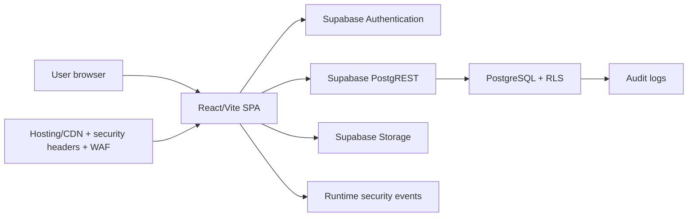

# Architecture

## System context

ContractConnect is a browser-based single-page application built with React and Vite. It communicates directly with Supabase using the authenticated user's JSON Web Token. There is no custom application server.

## Components

### React application

`App.jsx` owns navigation, application state, screens, modals, data loading, and record workflows. It is intentionally compact for the MVP, but future growth should split screens and forms into dedicated modules rather than continuing to expand one file.

### Authentication

Supabase handles identity, session persistence, token refresh, password recovery, and email confirmation. ContractConnect profiles add application roles and an `is_active` approval gate. Authentication proves identity; active membership and RLS authorise access.

### Database access

The browser uses the Supabase publishable/anonymous key plus the current user's token. PostgreSQL RLS evaluates all reads and writes. The publishable key is not a secret; the service-role key must never reach the browser.

### Document storage

Contract documents use a private bucket. File paths begin with `all/` or `restricted/`; RLS and Storage policies enforce manager access to restricted files. Downloads use signed URLs valid for 60 seconds.

Avatar files use a public bucket and user-specific path policies. Public visibility must be considered when choosing profile images.

### Runtime protection

The frontend validates production configuration, clears sensitive legacy browser storage, captures CSP/runtime/render failures, records sanitised events, and revalidates sessions periodically. These are RASP-aligned controls, not a certified server RASP agent.

### Edge protection

Hosting configuration supplies security headers. Terraform defines Cloudflare custom and managed WAF rules. These controls become effective only after deployment and external configuration.

## Data flows

### Sign-in

1. User submits email and password to Supabase Authentication.
2. Supabase returns a session after successful authentication.
3. ContractConnect loads the user's profile.
4. Inactive profiles see an approval-pending screen.
5. Active profiles access records according to RLS and role.

### CRM record change

1. User edits a form in the browser.
2. The relevant library maps camelCase fields to database columns.
3. Supabase sends the request with the user's token.
4. RLS permits or rejects the operation.
5. A database trigger writes the change to `audit_logs`.
6. The UI updates only after a successful database response.

### Document download

1. User requests a document.
2. Contract-document metadata RLS determines whether the row is visible.
3. Storage policy determines whether a signed URL can be created.
4. The browser opens the 60-second URL in a separate tab.

## Trust boundaries

- Browser code and UI state are untrusted.
- Supabase Authentication validates identity but does not by itself approve workspace membership.
- RLS and Storage policies are the authoritative permission controls.
- Manager-only content crosses a privilege boundary inside one customer workspace.
- Customer isolation is provided by dedicated deployments.
- CSV downloads and browser-displayed data leave server-side access control after delivery.
- Uploaded documents remain untrusted content until malware scanning is implemented.

## Quality attributes

| Attribute | Current approach | Known limitation |
|---|---|---|
| Security | Auth, approval, RLS, private Storage, audit, runtime telemetry, headers, WAF config | WAF/alerts require deployment; no malware scan or formal RASP agent |
| Availability | Managed Supabase and static hosting | Recovery configuration and restore exercises are external |
| Performance | Parallel initial queries, client-side filters, small MVP dataset | No pagination or server-side reporting for large datasets |
| Maintainability | Library boundary for Supabase access, documented migrations | `App.jsx` should be decomposed as features grow |
| Portability | Standard Vite static output | Direct Supabase integration couples backend behaviour to Supabase |

## Future architecture changes requiring review

- Shared multi-tenancy
- Backend-for-frontend or API gateway
- Calendar, email, e-signature, or AI integrations
- Automated notifications
- Malware scanning pipeline
- Subscription and billing enforcement
- Enterprise SSO or formal RASP integration

